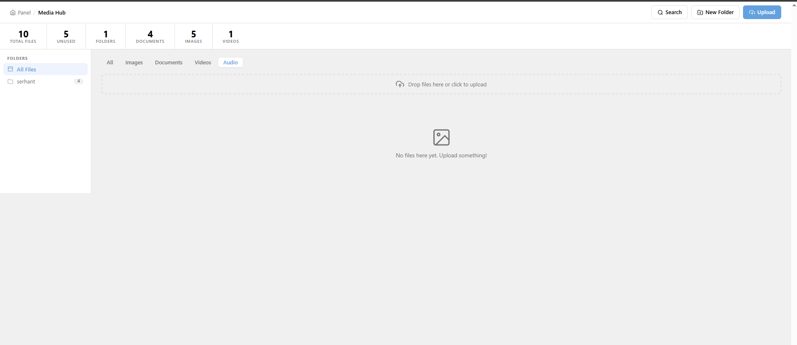

# Kirby Media Hub Pro

A centralized media library plugin for [Kirby CMS](https://getkirby.com) 5 — WordPress-style asset management built directly into the Panel.



---

## Versions

| Version | Price | Key additions |
|---------|-------|---------------|
| **V1 — Pro** | €50 | Folders, search, metadata, picker field, usage tracking, stats |
| **V2 — Pro Smart** | €90 | + 2-level subfolders, tags, smart filters, bulk operations, duplicate detection |

---

## Features

### V1 — Core
- **Dedicated Panel area** — full-screen Media Hub accessible from the Kirby sidebar
- **Folder organisation** — create and delete folders to keep assets tidy
- **Drag-and-drop upload** — upload files directly to any folder
- **Full-text search** — searches filename, title, alt text, description, copyright, and photographer simultaneously
- **File metadata** — edit title, alt text, description, copyright, photographer, and upload date per file
- **`mediahubpicker` field** — custom field type for any blueprint; works inside structure fields
- **UUID-based references** — saved as `file://uuid` — identical format to Kirby's native `files` field
- **Usage tracking** — see every page that references a given file
- **Dashboard stats** — total files, unused files, type breakdown, recent uploads, largest files
- **Auto-refresh stats** — counters update immediately after upload or delete
- **No build step** — pure PHP + Vue 3 template strings

### V2 — Pro Smart additions
- **2-level subfolder support** — nested folders in the sidebar with expand/collapse, breadcrumbs, correct upload URLs
- **Tags & Keywords** — tag files with comma-separated keywords; tag cloud in sidebar with click-to-filter
- **Delete tag globally** — remove a tag from all files at once with a single click (hover × on any tag)
- **Smart Filtering** — filter by upload date range, uploaded-by user, and file size (min/max KB)
- **Bulk Operations** — select multiple files → bulk delete, bulk move to folder, bulk rename (pattern `file-{n}`), bulk tag assignment (add / remove / replace)
- **Duplicate Detection** — scan for exact duplicates (MD5 hash) and similar-named files; keep oldest, newest, or shortest name with one click
- **Improved picker** — sidebar layout with scrollable folder tree (subfolders collapsible) + tag filter; replaces flat tab row that broke at scale

---

## Requirements

- Kirby CMS **5.0** or higher
- PHP **8.1** or higher

---

## Installation

1. Purchase a license at [kirbycode.com](https://kirbycode.com)
2. Download the plugin zip from your account
3. Extract and copy the `media-hub-pro` folder into your site's `site/plugins/` directory
4. The plugin auto-creates `content/media-hub/` on the first page load — no further setup needed

---

## Configuration

All options go in your site's `config/config.php`:

```php
return [
    // Change the slug of the hub root page (default: 'media-hub').
    // Useful if your site already has a page at that slug.
    'kirbycode.media-hub.root-slug' => 'media-hub',
];
```

---

## Blueprint Usage

Add the `mediahubpicker` field type to any page or file blueprint:

### Single image picker

```yaml
fields:
  hero_image:
    label: Hero Image
    type: mediahubpicker
    multiple: false
    accept: image
```

### Multi-select gallery

```yaml
fields:
  gallery:
    label: Gallery
    type: mediahubpicker
    multiple: true
    accept: image
    help: Pick images from the Media Hub
```

### Document / PDF picker

```yaml
fields:
  brochure:
    label: Download
    type: mediahubpicker
    multiple: false
    accept: document
```

### Field options

| Option | Type | Default | Description |
|--------|------|---------|-------------|
| `multiple` | bool | `true` | Allow selecting more than one file |
| `accept` | string | *(all)* | Filter picker to a type: `image`, `document`, `video`, `audio` |
| `label` | string | `Media Hub Files` | Panel field label |
| `help` | string | — | Help text shown below the field |

### What gets saved

The field writes a standard Kirby YAML list of `file://` UUIDs to the content `.txt` file — the same format as Kirby's built-in `files` field:

```
Hero_image:

- file://abc123def456
```

---

## PHP Template Usage

### Single file

```php
$hero = $kirby->file($page->hero_image()->value());
if ($hero) {
    echo 'url() . '" alt="' . $hero->content()->alt() . '">';
}
```

### Multiple files / gallery

```php
foreach ($page->gallery()->yaml() as $ref) {
    $file = $kirby->file($ref);
    if ($file) {
        echo 'url() . '" alt="' . $file->content()->alt() . '">';
    }
}
```

---

## Bulk Operations (V2)

Enable **Select mode** in the toolbar to check multiple files, then choose an action:

| Action | What it does |
|--------|--------------|
| **Bulk Delete** | Permanently deletes all selected files |
| **Bulk Move** | Moves all selected files to a chosen folder |
| **Bulk Rename** | Renames using a pattern, e.g. `photo-{n}` → `photo-1.jpg`, `photo-2.jpg` |
| **Bulk Tag** | Add / Remove / Replace tags on all selected files at once |

---

## Duplicate Detection (V2)

Open **Duplicates** from the toolbar to scan the library:

- **Exact duplicates** — files with identical MD5 hash
- **Similar names** — files with matching base names after stripping suffixes like `-final`, `-copy`, `-v2`, `(1)`, etc.

For each group you can: keep the oldest, keep the newest, keep the shortest filename, or manually pick which copy to keep.

---

## Supported File Types

| Category | Extensions |
|----------|-----------|
| Images | jpg, jpeg, png, gif, webp, svg, avif |
| Documents | pdf, doc, docx, xls, xlsx, ppt, pptx, txt |
| Video | mp4, mov, webm, avi |
| Audio | mp3, wav, ogg, m4a |
| Archives | zip, gz, tar |
| Design | ai, eps, psd |

---

## How It Works

The plugin registers a Kirby content page at `content/media-hub/` (auto-created on first load). Subfolders are standard Kirby child pages with the `media-hub-folder` template. Files use Kirby's native flat-file storage with `.txt` metadata sidecars.

The Panel area is a custom Kirby `area` with Vue 3 components (no build step — uses Kirby's bundled runtime). REST API routes under `/api/media-hub/` handle all operations.

---

## Changelog

See [CHANGELOG.md](CHANGELOG.md).

---

## License

MIT — [Shivlal Sheladiya](https://kirbycode.com)

---

## Credits

Built with [Kirby CMS](https://getkirby.com) by [kirbycode.com](https://kirbycode.com).

If this plugin saves you time, consider [sponsoring further development](https://kirbycode.com).
