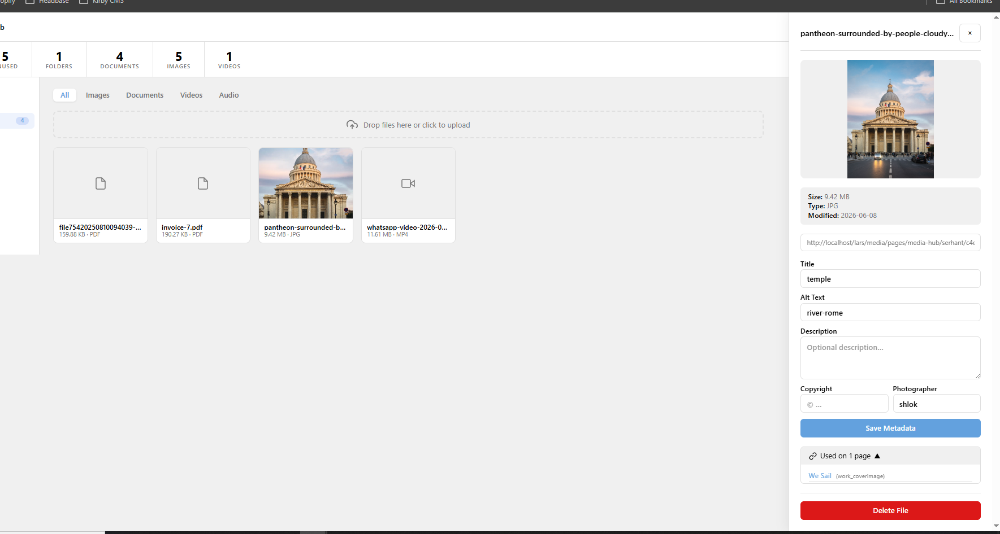

# Kirby Media Hub

A centralized media library plugin for [Kirby CMS](https://getkirby.com) 5 — WordPress-style asset management built directly into the Panel.




---

## Features

- **Dedicated Panel area** — a full-screen Media Hub accessible from the Kirby sidebar
- **Folder organisation** — create and delete subfolders to keep assets tidy
- **Drag-and-drop upload** — upload files directly to any folder
- **Full-text search** — searches filename, title, alt text, description, copyright, and photographer fields simultaneously
- **File metadata** — edit title, alt text, description, copyright, photographer, and upload date per file
- **`mediahubpicker` field** — a custom field type that lets any blueprint pick files from the Media Hub
- **UUID-based references** — saved as `file://uuid` — identical format to Kirby's native `files` field
- **Works inside structure fields** — the inline picker does not conflict with Kirby's dialog close handlers
- **Usage tracking** — see every page that references a given file
- **Dashboard stats** — total files, unused files, file-type breakdown, recent uploads, largest files
- **Auto-refresh stats** — counters update immediately after upload or delete
- **No build step** — pure PHP + Vue 3 template strings, drops straight into `site/plugins/`

---

## Requirements

- Kirby CMS **5.0** or higher
- PHP **8.1** or higher

---

## Installation

### Composer (recommended)

```bash
composer require kirbycode/media-hub
```

### Manual

1. Download or clone this repository.
2. Copy the `media-hub-pro` folder into your site's `site/plugins/` directory.
3. The plugin auto-creates `content/media-hub/` on the first page load — no further setup needed.

---

## Configuration

All options go in your site's `config/config.php`:

```php
return [
    // Change the slug of the hub root page (default: 'media-hub').
    // Useful if your site already has a page at that slug.
    'kirbycode.media-hub.root-slug' => 'media-hub',
];
```

---

## Blueprint Usage

Add the `mediahubpicker` field type to any page or file blueprint:

### Single image picker

```yaml
fields:
  hero_image:
    label: Hero Image
    type: mediahubpicker
    multiple: false
    accept: image
```

### Multi-select gallery

```yaml
fields:
  gallery:
    label: Gallery
    type: mediahubpicker
    multiple: true
    accept: image
    help: Pick images from the Media Hub
```

### Document / PDF picker

```yaml
fields:
  brochure:
    label: Download
    type: mediahubpicker
    multiple: false
    accept: document
```

### Field options

| Option | Type | Default | Description |
|---|---|---|---|
| `multiple` | bool | `true` | Allow selecting more than one file |
| `accept` | string | *(all)* | Filter picker to a type: `image`, `document`, `video`, `audio` |
| `label` | string | `Media Hub Files` | Panel field label |
| `help` | string | — | Help text shown below the field |

### What gets saved

The field writes a standard Kirby YAML list of `file://` UUIDs to the content `.txt` file — the same format as Kirby's built-in `files` field:

```
Hero_image:

- file://abc123def456
```

---

## Supported File Types

| Category | Extensions |
|---|---|
| Images | jpg, jpeg, png, gif, webp, svg, avif |
| Documents | pdf, doc, docx, xls, xlsx, ppt, pptx, txt |
| Video | mp4, mov, webm, avi |
| Audio | mp3, wav, ogg, m4a |
| Archives | zip, gz, tar |
| Design | ai, eps, psd |

---

## How It Works

The plugin registers a Kirby content page at `content/media-hub/` (created automatically on first load). Subfolders are standard Kirby child pages. Files are stored using Kirby's native file system with `.txt` metadata sidecars.

The Panel area is a custom Kirby `area` with Vue 3 components (no build step — uses Kirby's bundled runtime). Ten REST API routes under `/api/media-hub/` handle all operations.

---

## Changelog

See [CHANGELOG.md](CHANGELOG.md).

---

## License

MIT — [Shivlal Sheladiya](https://kirbycode.com)

---

## Credits

Built with [Kirby CMS](https://getkirby.com) by [kirbycode.com](https://kirbycode.com).

If this plugin saves you time, consider [sponsoring further development](https://kirbycode.com).
